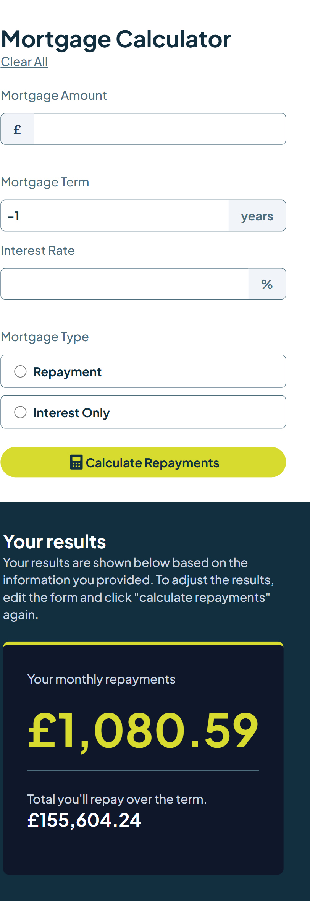

# Frontend Mentor - Mortgage repayment calculator solution

This is a solution to the [Mortgage repayment calculator challenge on Frontend Mentor](https://www.frontendmentor.io/challenges/mortgage-repayment-calculator-Galx1LXK73). Frontend Mentor challenges help you improve your coding skills by building realistic projects.

## Table of contents

- [Overview](#overview)
  - [The challenge](#the-challenge)
  - [Screenshot](#screenshot)
  - [Links](#links)
- [My process](#my-process)
  - [Built with](#built-with)
  - [What I learned](#what-i-learned)
  - [Continued development](#continued-development)
  - [Useful resources](#useful-resources)
  - [AI Collaboration](#ai-collaboration)
- [Author](#author)
- [Acknowledgments](#acknowledgments)

**Note: Delete this note and update the table of contents based on what sections you keep.**

## Overview

This is a responsive mortgage repayment calculator built with React and Vite. The application allows users to input mortgage details and instantly calculate monthly payments, total repayment amounts, and interest paid over the loan term. It features form validation, keyboard accessibility, and an intuitive user interface optimized for all device sizes.

### The challenge

Users should be able to:

- Input mortgage information and see monthly repayment and total repayment amounts after submitting the form
- See form validation messages if any field is incomplete
- Complete the form only using their keyboard
- View the optimal layout for the interface depending on their device's screen size
- See hover and focus states for all interactive elements on the page

### Screenshot

.png)

### Links

- Solution URL: [Add solution URL here](https://your-solution-url.com)
- Live Site URL: [Add live site URL here](https://your-live-site-url.com)

## My process

I started by breaking down the project requirements into components: a form for mortgage inputs, calculation logic, and a results display. I used React hooks to manage form state and validation, ensuring real-time calculations as users input data. The layout was designed mobile-first using CSS Grid and Flexbox for responsive behavior across all device sizes. I implemented keyboard navigation and focus management for accessibility, and added visual feedback for form validation errors.

### Built with

- Semantic HTML5 markup
- CSS custom properties
- Flexbox
- CSS Grid
- Mobile-first workflow
- [React](https://reactjs.org/) - JS library

**Note: These are just examples. Delete this note and replace the list above with your own choices**

### What I learned

Learned how to show validation errors in UI/UX (required fields, numeric ranges).
Practiced responsive layout with Tailwind + CSS Grid/Flexbox (mobile-first, large breakpoint).

### Continued development

Areas to enhance in future iterations:

- **Advanced Calculation Features**: Add support for overpayments, extra payments, and amortization schedules
- **Data Persistence**: Implement localStorage to save user calculations and history
- **Export Functionality**: Allow users to download results as PDF or CSV
- **Refinement Comparison**: Enable side-by-side comparison of different mortgage scenarios
- **Interest Rate Trends**: Integrate real-time interest rate data from APIs
- **Performance Optimization**: Implement code splitting and lazy loading for faster initial load
- **Unit Tests**: Add Jest and React Testing Library tests for critical components
- **Mobile App**: Convert to React Native for iOS/Android deployment

### Useful resources

- [React Hook Form](https://react-hook-form.com/) - A popular third-party plugin for React projects.
- [How to Deploy Vite + React App to GitHub Pages in 5 Minutes! 🌍](https://www.youtube.com/watch?v=XQAaAQnw2Mk&t=199s) - How to Deploy Vite + React App to GitHub Pages in 5 Minutes! 
🚀 In this quick and easy tutorial, learn how to deploy your Vite + React application to GitHub Pages for free!
  Whether you're building a portfolio, personal project, or launching a startup, hosting your Vite React app on GitHub Pages is a fast and cost-effective solution.

- [transform](https://transform.tools/css-to-tailwind) - This site converts Vanilla CSS to Tailwind.

### AI Collaboration

Describe how you used AI tools (if any) during this project. This helps demonstrate your ability to work effectively with AI assistants.

Used this assistant as a coding mentor / pair-programmer during the project.

- What tools did you use (e.g., ChatGPT, Claude, GitHub Copilot)?

Only GitHub Copilot

- How did you use them (e.g., debugging, generating boilerplate, brainstorming solutions)?

Asked for guidance on how to write/read/structure React + Tailwind code and README sections.
Used suggestions for form validation, UI behavior, and documentation wording.
Got step-by-step support while preserving a “do it yourself” learning.

- What worked well? 

Quick feedback loop on copy + content.
Good prompts for “what to write in README” and where to improve.
Helped translate technical behavior into plain explanation.

What didn't?

Still choosing exact text to match my voice; AI gives a starting point, not final prose.
Sometimes the first answer is high-level; needed follow-ups for specifics (fine for learning stage).

## Author

- Website - [Add your name here](https://www.your-site.com)
- Frontend Mentor - [@yourusername](https://www.frontendmentor.io/profile/yourusername)
- Twitter - [@yourusername](https://www.twitter.com/yourusername)
